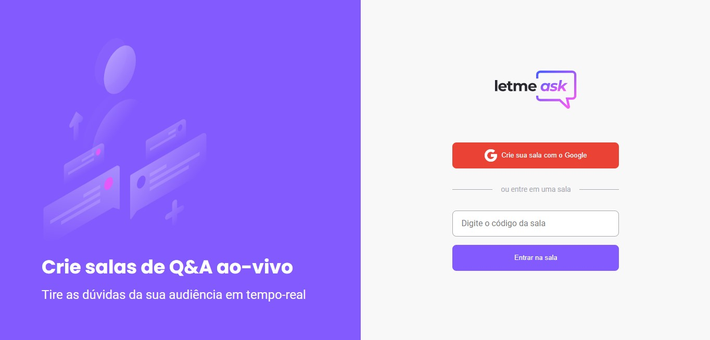
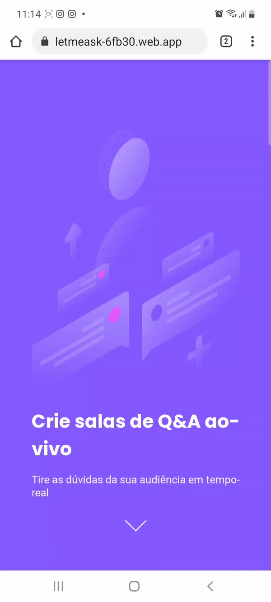

# 💜 Letmeask - Next Level Week Together 
  
## Descrição
Esta projeto foi desenvolvido durante o evento Next Level Week #Together da Rocketseat. 
O Letmeask é uma solução para o gerenciamento de perguntas e respostas entre público e administrador em tempo real. Um exemplo de uso seria durante uma live o streamer enviar o link da sala para que seu público faça o envio das perguntas e acompanhe as respostas e curtidas das perguntas.

## 💻📱 Preview
<a href="https://letmeask-6fb30.web.app/">Acesse</a>
<div style="display: flex; margin-bottom: 2rem">
  
  
</div>

## 🔨 Ferramentas Utilizadas
- [ReactJS](https://reactjs.org/)
- [Typescript](https://www.typescriptlang.org/)
- [Firebase](https://firebase.google.com/?hl=pt)
- [SASS](https://sass-lang.com/)

## 🚀 Desafio #NLWTogether (Próximo Nível) 
Durante o evento foi nos dado o desafio de ao concluírmos a semana com as aulas ir além com a nossa aplicação, desenvolver novas funcionalidades e levar a aplicação ao próximo nível.


## 💡 Novas funcionalidades

- Responsividade
- Notificações toast
- Fazer o login pela sala após entrar com o código
- Exibir foto do usuário após logar com o Google no botão da Home
- Proteção a rota de criação de salas quando não há usuário logado
- Botão de voltar para Home para o usuário
- Travar o envio de perguntas de uma sala encerrada
- Troca de conta do usuário na Home
- Ordenação das perguntas de acordo com o status de respondida (as pendentes ficam no topo)
- Ordenação das perguntas pela quantidade de likes
- Desabilitar o botão de curtir caso o usuário não esteja logado
- Evitar acesso da tela de admin para um usuário que não é o criador da sala
- Permitir que o admin volte para a Home clicando na logo
- Exibir imagem quando não há perguntas na sala, indicando que está vazia

## 📈 O que eu aprendi

Reforçei os meus conceitos de ReactJs (state, components, props, hooks), e aprendi vários conceitos novos como imutabilidade, closures, [Context Api](https://pt-br.reactjs.org/docs/context.html), a criação dos nossos próprios [Hooks](https://pt-br.reactjs.org/docs/hooks-custom.html), e o uso da biblioteca [react-hot-toast](https://react-hot-toast.com/) para trazer as notificações de erro da aplicação. 
Com relação ao Typescript pude entender melhor o porque do seu uso, e em geral posso resumir que ele só tem a contribuir para a experiência de desenvolvimento. 
Reforcei alguns conceitos do uso do pré-processador SASS, eu já havia tido um primeiro contato em uma #NLW anterior e agora pude notar realmente algumas vantagens do seu uso ao invés do CSS tradicional.
E com certeza um dos maiores conhecimentos adquiridos foi sem dúvidas o uso do Firebase, foi o meu primeiro contato com a ferramenta e de primeira realmente foi um pouco difícil entender, mas nada que assistir a aula 2 vezes e revisar o código linha por linha não resolva 😆. E por último, o desafio de trazer novas funcionalidades à aplicação pôde me fazer testar melhor a aplicação e incluir etapas que não existiam, tratar alguns bugs e melhorar ainda mais a experiência do usuário.

## ⚙️ Executando o projeto 

Execute os comandos no seu terminal:

```bash
# Clone o repositório
$ git clone https://github.com/brunanunesbarros/letmeask.git

# Entre no diretório
$ cd letmeask

# Instale as dependências
$ npm install

# Execute a aplicação
$ npm start
```

Acesse em seu navegador http://localhost:3000/

## Autoria

Feito por [Bruna Barros](https://github.com/brunanunesbarros) 💗
[](https://www.linkedin.com/in/bruna-barros-8180a4213/)


